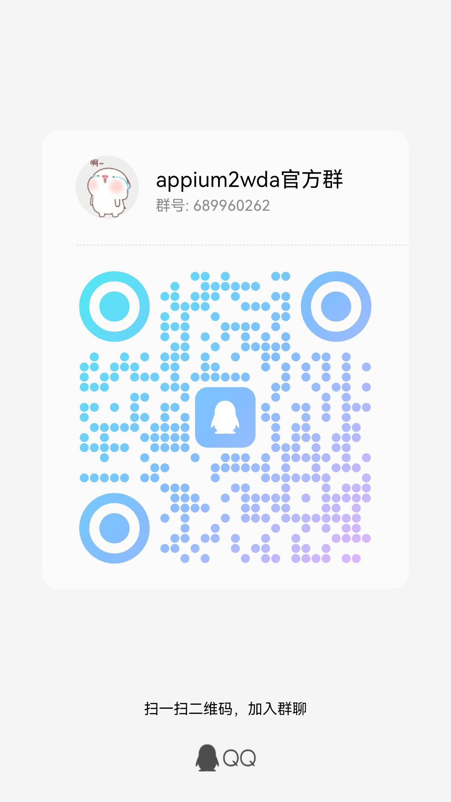

# 背景
在做IOS自动化测试的过程中，有些测试代码使用的是appium开发的，有些使用的是facebook-wda（下面简称wda）开发的，
为了做统一的兼容，因此开发了该项目，把appium的请求重新转换为wda的请求

# 项目介绍
该项目(appium2wda)是把appium的请求连接重新封装成wda(facebook-wda)去请求，本质上就是把wda的driver重新封装了一下。
由于部分协议转换需要修改wda的代码，因此直接把修改之后的facebook-wda的库拿嵌入到该项目中了，
同时也修改了不少facebook-wda的源代码，使其支持多台手机同时运行和屏幕录制

欢迎加QQ群交流，提交pr


# 使用环境
当前使用环境是在windows下python3.7.3使用的，其他环境暂未测试，大家可以自行尝试，环境提交pr, 参考demo.py

# 项目依赖
见 requirements.txt文件

# 使用介绍
当前不支持pip安装，使用者可以把当前项目代码复制到自己的项目中直接使用。
使用者可以参考appium2wda目录下的demo.py和config.yaml示例文件，也可以参考下面的代码

```cython
from appium2wda import webdriver

desired_caps = {
    "platformName": "ios", 
    "platformVersion": "14.3", 
    "deviceName": "00008020-001C2541", 
    "udid": "00008020-001C2541", 
    "ip": "127.0.0.1", 
    "port": 4725, 
    "wdaLocalPort": 8100, 
    "mjpegServerPort": 9102, 
    "webDriverAgentUrl": "127.0.0.1:8100", 
    "noReset": True, 
    "usePrebuiltWDA": False, 
    "useXctestrunFile": False, 
    "skipLogCapture": True, 
    "automationName": "XCUITest", 
    "bundleId": ""
}

driver = webdriver.Remote(desired_caps)
```

# 当前支持的appium功能接口
## 查找元素 find_element 或者 find_elements
元素定位类型支持如下转换（下面的是appium的写法列表）

```text
-ios predicate string
-ios class chain
xpath
name
id
label
class name
value
```

返回来的元素对象基本和appium返回来的元素对象一致，所以appium的元素方法或者属性也大部分是支持的，
这里没有详细列出，如果有问题可以提issues

## TouchAction
```cython
# 如果你的原始代码里面写的是下面这样
appium.webdriver.common.touch_action import TouchAction

# 你只需要改为
from appium2wda import webdriver
TouchAction = webdriver.TouchAction
```

## MultiAction
```cython
# 如果你的原始代码里面写的是下面这样
from appium.webdriver.common.multi_action import MultiAction

# 你只需要改为
from appium2wda import webdriver
MultiAction = webdriver.MultiAction
```

## 屏幕录制
```cython
import base64

driver.start_recording_screen(videoType='mpeg4', timeLimit=600)
time.sleep(10)
payload = driver.stop_recording_screen()
with open("test-record.mp4", "wb") as fd:
    fd.write(base64.b64decode(payload))
```

# 不支持的功能
无法一一列举，使用时如有发现没有attribute的，就算是不支持了
```text
键盘事件
其他未知事件...
```